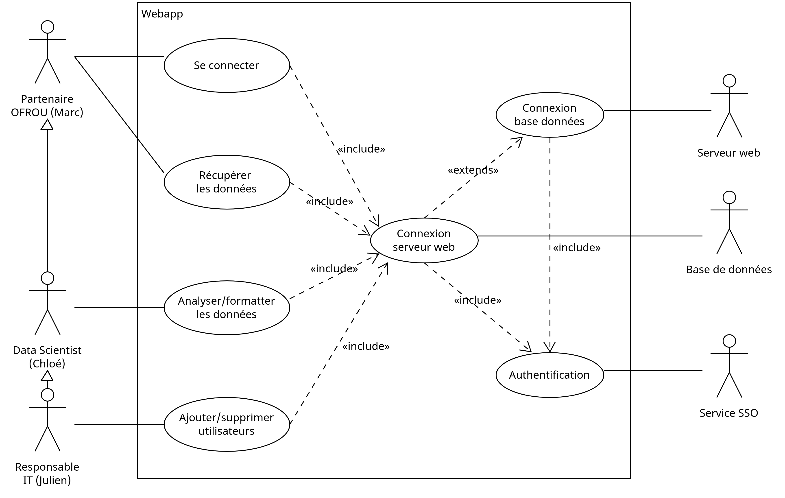

# Cahier des charges pour le projet de dispositif IoT pour la sécurité routière

## Introduction
Le présent document établit les spécifications et les exigences pour le développement d'un dispositif IoT visant à améliorer la sécurité routière en détectant les situations de dépassement dangereux sur les routes suisses.

## Cadre du projet
Ce projet vise à concevoir un dispositif à installer sur les poids lourds et les engins agricoles, capable de détecter la présence de véhicules dans le sens inverse et d'alerter les conducteurs des véhicules suivants lorsque le dépassement n'est pas sûr. Le dispositif collectera également des statistiques sur les situations de dépassement dangereuses pour informer les décisions d'aménagement routier.

## Dispositif
### Besoins fonctionnels
- Le dispositif est séparé en deux parties, une partie est installée à l'avant du véhicule et l'autre à l'arrière.
    - La partie disposée à l'avant du véhicule est équipée de capteurs de proximité pour détecter les véhicules arrivant en sens inverse.
    - La partie à l'arrière est équipée d'un écran led pour afficher l'alerte aux conducteurs des véhicules suivants.
- Le dispositif doit être capable de communiquer sans fil entre les deux parties, en temps réel, pour déclencher l'alerte lorsque le dépassement est non sécurisé.
- Chaque partie du dispositif doit pouvoir être alimentée par l'alimentation du véhicule.
- La partie arrière du dispositif doit être équipée d'une batterie afin de pouvoir être déplacé et installé sur des remorques ou des engins agricoles sans alimentation électrique. L'autonomie de la batterie doit être d'au moins 24 heures.

- Le dispositif doit être capable de détecter avec précision la présence de véhicules arrivant en sens inverse, spécialement lors des tentatives de dépassement sur des routes à double sens.
- Le dispositif doit être capable d'afficher clairement et instantanément une alerte aux conducteurs des véhicules suivants, indiquant lorsque le dépassement est non sécurisé.
    - Cette alerte doit être affichée à l'aide d'un écran led à l'arrière du véhicule, cet écran affiche une image d'une voiture qui dépasse un camion avec un point d'exclamation rouge pour indiquer le danger.

- Le dispositif doit être capable d'enregistrer des données détaillées sur chaque situation de dépassement dangereux, incluant la date, l'heure, la durée et le lieu précis de l'événement.
- Le dispositif doit être équipé d'une connectivité cellulaire pour transmettre les données collectées à une plateforme web centralisée.
- Le dispositif stocke et envoie les données une fois par heure pour minimiser les coûts de communication et garantir une utilisation efficace de la bande passante.
- Le dispositif doit être capable de stocker jusqu'à 24h de données en local.
- Le dispositif doit être équipé d'un GPS pour enregistrer les coordonnées géographiques exactes de chaque événement.

- Le dispositif ne doit pas demander d'interaction de la part des conducteurs pour fonctionner, il doit être entièrement automatisé et fonctionner en arrière-plan.

- Lors de l'installation initiale, le dispositif doit être enregistré sur la plateforme web centralisée pour permettre le suivi et la gestion des données collectées.
    - Cet enregistrement est fait à l'aide d'un code unique imprimé sur le dispositif, qui doit être scanné par un technicien lors de l'installation.
- L'enregistrement du dispositif sur la plateforme web centralisée requiert de renseigner le type de véhicule sur lequel il est installé.

### Exigences non-fonctionnelles
- **Robustesse et durabilité** : Le dispositif doit être conçu pour résister aux conditions environnementales adverses telles que les variations de température, l'humidité, la poussière, et les vibrations courantes sur les routes. Il doit également garantir une durabilité élevée pour minimiser les besoins de maintenance.
- **Conformité réglementaire** : Le dispositif doit respecter toutes les réglementations pertinentes, y compris le RGPD pour la protection des données personnelles, ainsi que les normes de sécurité routière et d'équipements électroniques en vigueur.
- **Facilité d'installation** : L'installation du dispositif doit être simple et rapide, sans nécessiter de modifications importantes du véhicule. L'installation doit pouvoir être effectuée par des techniciens qualifiés en moins d'une heure.

## Plateforme web centralisée
### Besoins fonctionnels
- La plateforme doit être accessible depuis n'importe quel navigateur web, sans nécessiter l'installation de logiciels supplémentaires.
- La plateforme web centralisée doit permettre l'enregistrement et la gestion des dispositifs installés.
- La plateforme doit permettre la visualisation des données collectées par les dispositifs, incluant les statistiques sur les situations de dépassement dangereux.
    - Ces données doivent être affichées sous la forme d'une carte interactive montrant les emplacements des incidents, avec des filtres pour afficher les données par date, heure, type de véhicule, etc.
- La plateforme doit permettre l'export des données collectées sous forme de fichiers CSV pour une analyse plus approfondie.

- L'accès à la plateforme doit être sécurisé par des identifiants et des mots de passe uniques pour chaque utilisateur.
- Des rôles sont définis pour les utilisateurs de la plateforme, avec des droits d'accès différenciés en fonction de leur rôle.
- Il doit être possible pour les administrateurs de la plateforme de gérer les utilisateurs et les dispositifs enregistrés.

### Exigences non-fonctionnelles
- **Sécurité des données** : La plateforme doit garantir la confidentialité et la sécurité des données collectées, en conformité avec les réglementations en vigueur.
- **Performances** : La plateforme doit être capable de gérer un grand nombre de dispositifs et de données, sans ralentissement notable. Les temps de réponse doivent être rapides pour assurer une expérience utilisateur fluide.
- **Facilité d'utilisation** : L'interface de la plateforme doit être intuitive et conviviale, permettant aux utilisateurs de naviguer facilement et d'accéder rapidement aux informations recherchées. Une documentation d'utilisation doit être fournie pour guider les utilisateurs dans l'utilisation de la plateforme.
- **Disponibilité** : La plateforme doit être disponible 24h/24 et 7j/7, avec une disponibilité garantie de 99,9% pour assurer un accès continu aux données collectées.

### Use case diagram

Ci-dessous, nous fournissons le diagramme d'utilisation de la plateforme web centralisée. Il démontre les rôles décris ci-avant, avec un aperçu généralisé de ce que la plateforme Web devra offrir.

## Maintenance et support
Une assistance technique et un support de maintenance pourront être fournis par l'entreprise cependant cela n'est pas inclus dans le projet initial et sera soumis à des conditions contractuelles distinctes.

## Propriété intellectuelle
Le dispositif et ses composants, y compris le matériel, les logiciels et les données collectées, seront la propriété exclusive de l'entreprise qui finance le projet. Toute propriété intellectuelle générée dans le cadre du projet sera transférée à l'entreprise à la fin du développement.

## Livrables
Les livrables du projet comprennent :
- Un prototype fonctionnel du dispositif IoT pour la sécurité routière, comprenant les composants matériels et logiciels nécessaires.
- Les plans de conception détaillés du dispositif, y compris les schémas électriques, les spécifications des composants, les instructions d'assemblage, etc.
- La plateforme web centralisée pour la gestion des dispositifs et l'analyse des données collectées.
- Une documentation complète du projet, comprenant les spécifications techniques, les instructions d'installation et d'utilisation, les guides de maintenance, etc.

## Estimation des coûts
L'estimation des coûts est fournie à titre indicatif et peut varier en fonction des spécifications finales du projet.
### Coûts de développement
- Coûts des composants matériels utilisés pour le prototype du dispositif IoT.
- Coûts de développement logiciel pour la programmation des fonctionnalités du dispositif et de la plateforme web centralisée.
- Coûts de main-d'œuvre pour l'assemblage du prototype, l'installation du dispositif sur un véhicule, et la configuration initiale de la plateforme web.

Estimation : 249k-558k

### Coûts d'exploitation
- Coûts de communication pour la transmission des données collectées par les dispositifs à la plateforme web centralisée.
- Coûts d'hébergement de la plateforme web centralisée.
- Coûts de maintenance et de support technique pour assurer le bon fonctionnement du dispositif et de la plateforme. (Optionnel)

*Ce cahier des charges est soumis à l'approbation du comité de pilotage avant le début du développement du projet.*
